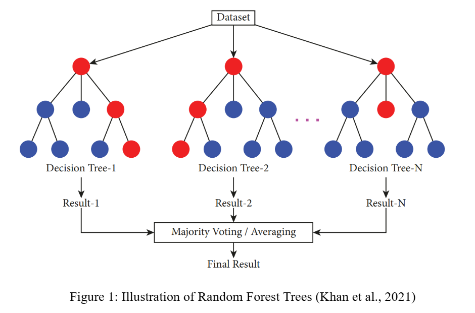
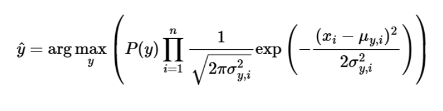
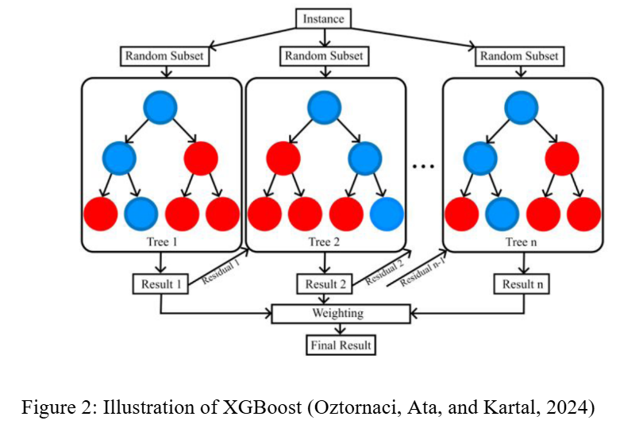
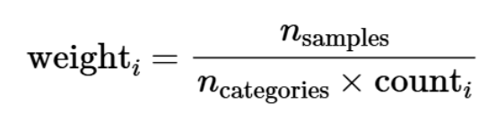
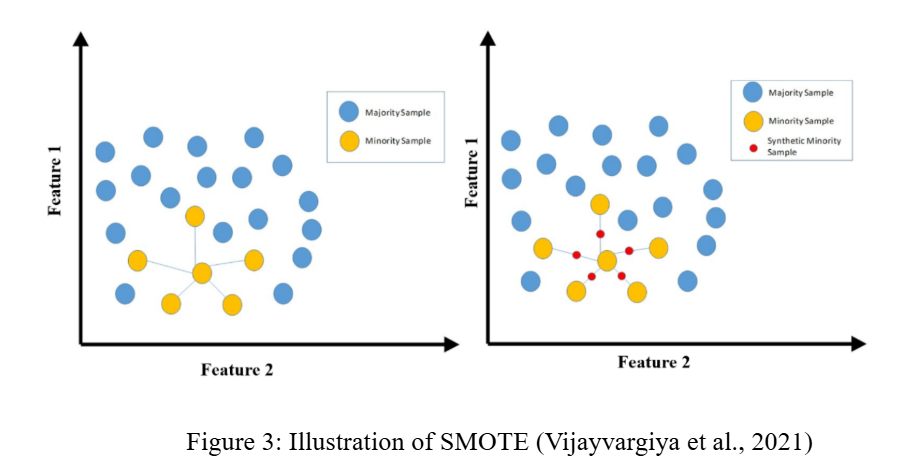
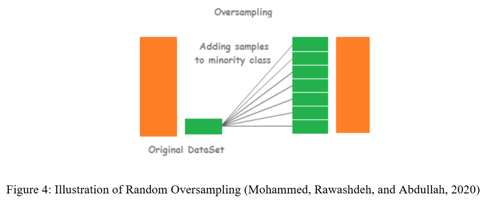
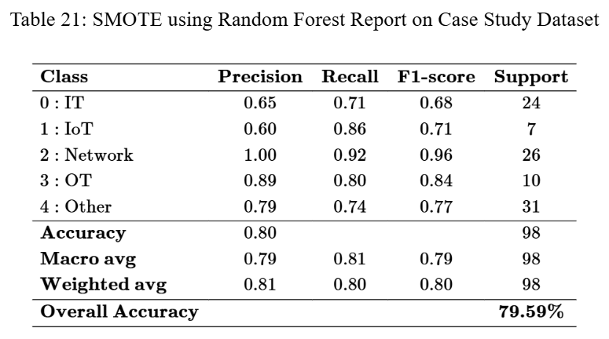

# ML-Based Fingerprinting Devices in OT Security

## Project description

The process of this project contains four main sections, each focusing on exploring a technique for handling class imbalance, along with that is three machine learning algorithms, and two smaller sections, which are data preprocessing and Case Study. The performance of these models is measured by four metrics, namely accuracy, precision, recall, and F1-score. By comparing and analyzing these results, the most efficient combination is identified as SMOTE and Random Forest, which will then be used for Case Study, which will involve applying this combination on an accurate real-world dataset to evaluate the practical application of these models. The final subsection of Case Study, the visualization of the Case Study is demonstrated for qualitative analysis purposes.

## Research question 
Comparing the Effectiveness of Machine Learning Algorithms for Predicting Device Types 

## Machine Learning Models

Random Forest

  

 

Naive Bayes

  

 
 
XGBoost

  

 

## Techniques for Handling Class Imbalance

Class Weighting

  

 

SMOTE (Synthetic Minority Over-sampling technique)

  

 
 
Random Oversampling

  

 

## Results Format

The results of the models in the .ipynb file are similar to the result of Case Study below, which consists of various metrics and accuracy:

  

 

## Experimental results

Main Summary of the results: 
1. The most efficient machine learning model was Random Forest, which consistently outperformed the other models, demonstrated its significant ability in handling class imbalance, and maintained high accuracy and other metrics in both datasets and across techniques. 
2. The worst performance consistently belonged to Naive Bayes. Despite the application of class weighting and random oversampling, this machine learning model still struggled to handle class imbalance, resulting in low accuracy and other metrics for all categories, with precision and recall values remaining below acceptable levels. 
3. SMOTE generally enhanced accuracy, precision, and recall, especially for minority classes. 
4. For highly imbalanced datasets, the combination of Random Forest and SMOTE stands as the most robust and efficient approach.
5. Case Study's results suggested that the model with Random Forest and SMOTE possesses high potential for real-world datasets and strongly indicate its practical use in real-life scenarios. 

